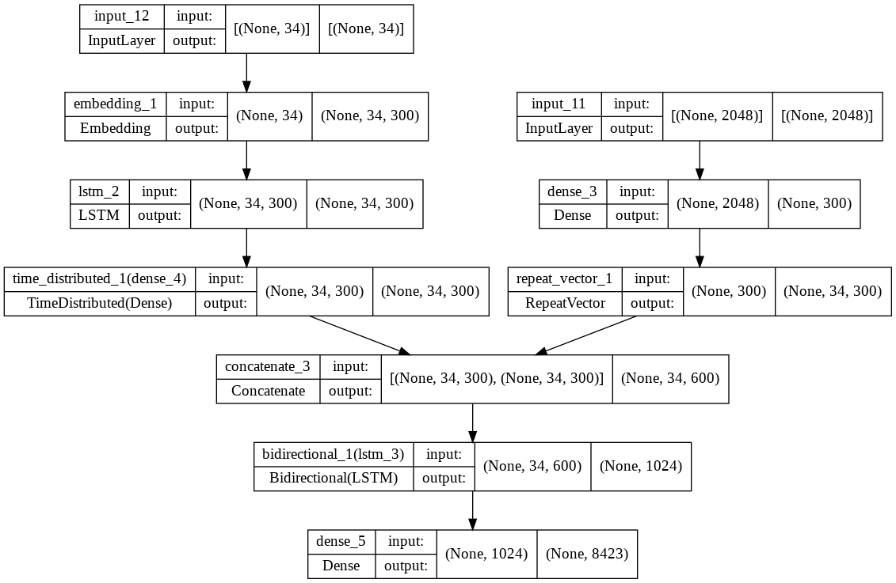
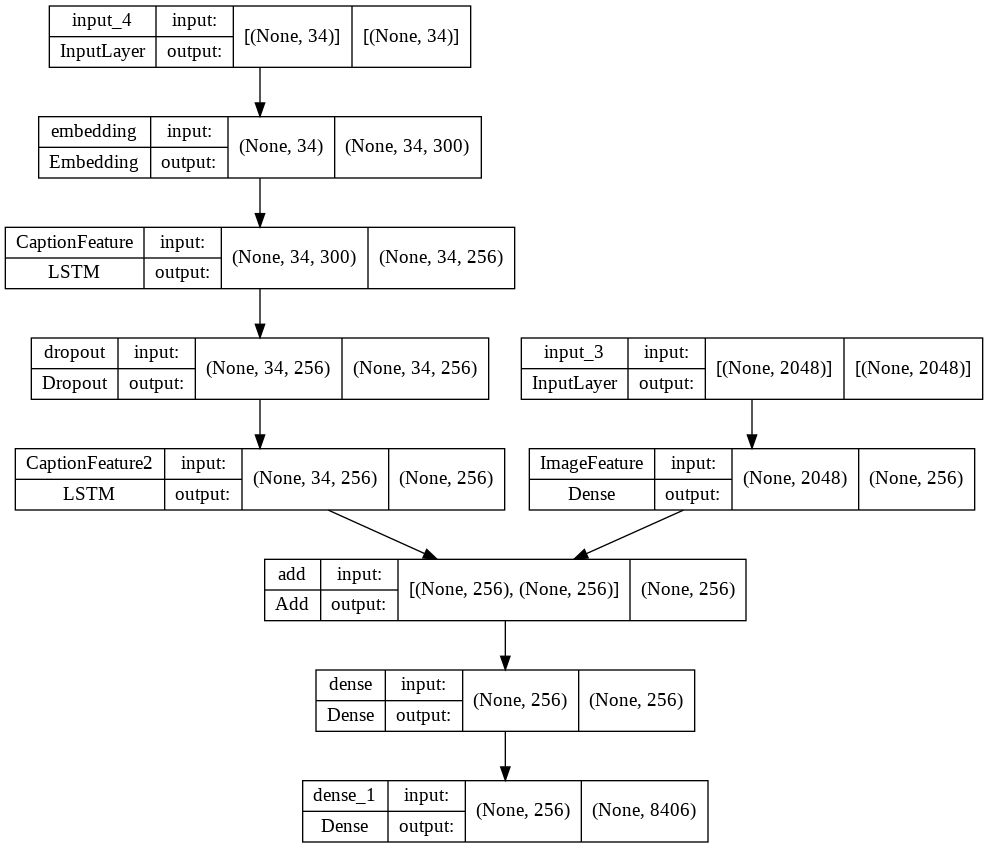
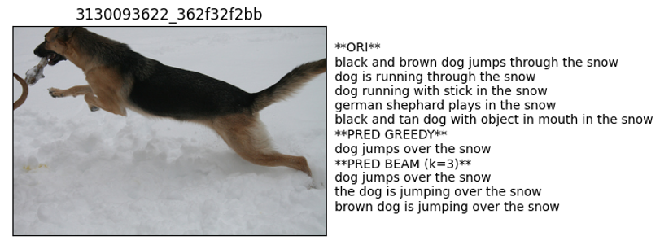
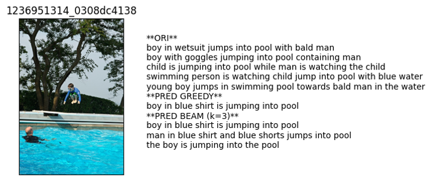
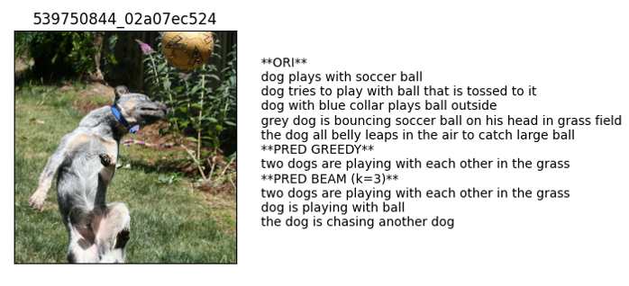
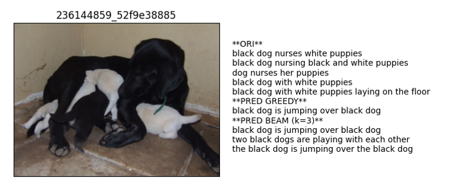

# Listing of experiments

|experiment_id|description|model|learning_rate|glove_embedding|dropout_rate|data_per_batch|epoch|batch_size|validation_freq|model_architecture|Greedy BELU-1|Greedy BELU-2|Greedy BELU-3|Greedy BELU-4|Beam BELU-1|Beam BELU-2|Beam BELU-3|Beam BELU-4|
|----|----|----|----|----|----|----|----|----|----|----|----|----|----|----|----|----|----|----|
|exp_3|VGG feature extractor with single LSTM model without embeddings|vgg16|0.0001|TRUE|0.04|6|80|32|1||0.418664786|0.262173984|0.187916746|0.089356784|0.409047235|0.251875285|0.180804115|0.086161993|
|exp_2|VGG feature extractor with single LSTM model and word embeddings|vgg16|0.0001|TRUE|0.04|6|80|32|1||0.407193246|0.249890581|0.181349745|0.087091612|0.399893443|0.241382263|0.173741196|0.081543736|
|**exp_1a**|InceptionV3 feature extractor with dual bi-directional LSTM model|inceptionV3|0.0001|TRUE|0.04|6|80|32|1||0.408475127|0.245591828|0.175804278|0.079447117|0.397987683|0.236669852|0.169261264|0.078074388|
|exp_1|InceptionV3 feature extractor with dual bi-directional LSTM model|inceptionV3|0.0001|TRUE|0.04|6|80|32|1||0.371679449|0.2214151|0.156965418|0.073317164|0.361968183|0.211797036|0.149362094|0.068082192|

# Samples

**Positive samples**

   

**Negative samples**

   

**Other Images**

# Conclusion

